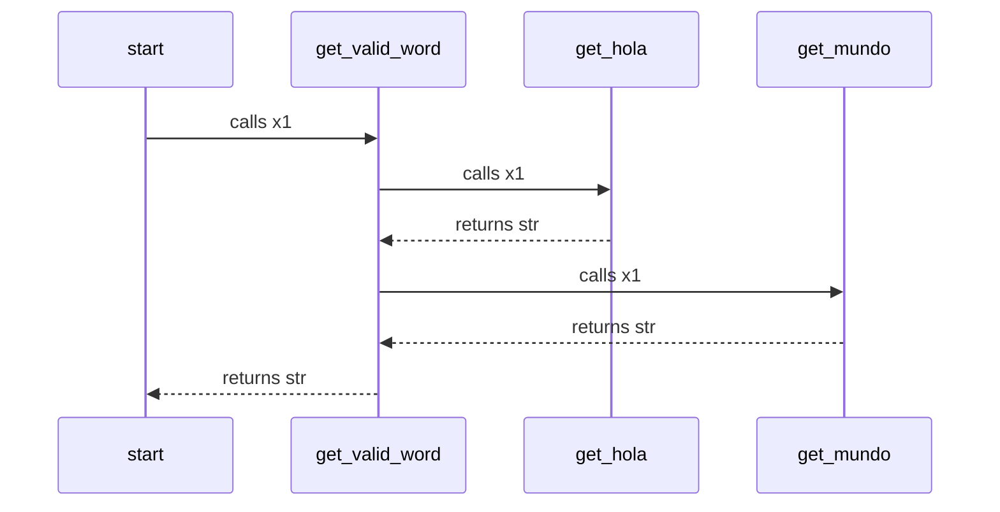

This is a mermaid diagram, you may need to install a [Browser Plugin](https://github.com/BackMarket/github-mermaid-extension) or [VsCode extension](https://marketplace.visualstudio.com/items?itemName=bierner.markdown-mermaid) or similar to view it.

You can also [view it full screen as an SVG](https://mermaid.ink/svg/c2VxdWVuY2VEaWFncmFtCiAgc3RhcnQtPj5nZXRfdmFsaWRfd29yZDogY2FsbHMgeDEKICBnZXRfdmFsaWRfd29yZC0+PmdldF9ob2xhOiBjYWxscyB4MQogIGdldF9ob2xhLS0+PmdldF92YWxpZF93b3JkOiByZXR1cm5zIHN0cgogIGdldF92YWxpZF93b3JkLT4+Z2V0X211bmRvOiBjYWxscyB4MQogIGdldF9tdW5kby0tPj5nZXRfdmFsaWRfd29yZDogcmV0dXJucyBzdHIKICBnZXRfdmFsaWRfd29yZC0tPj5zdGFydDogcmV0dXJucyBzdHIK)        

